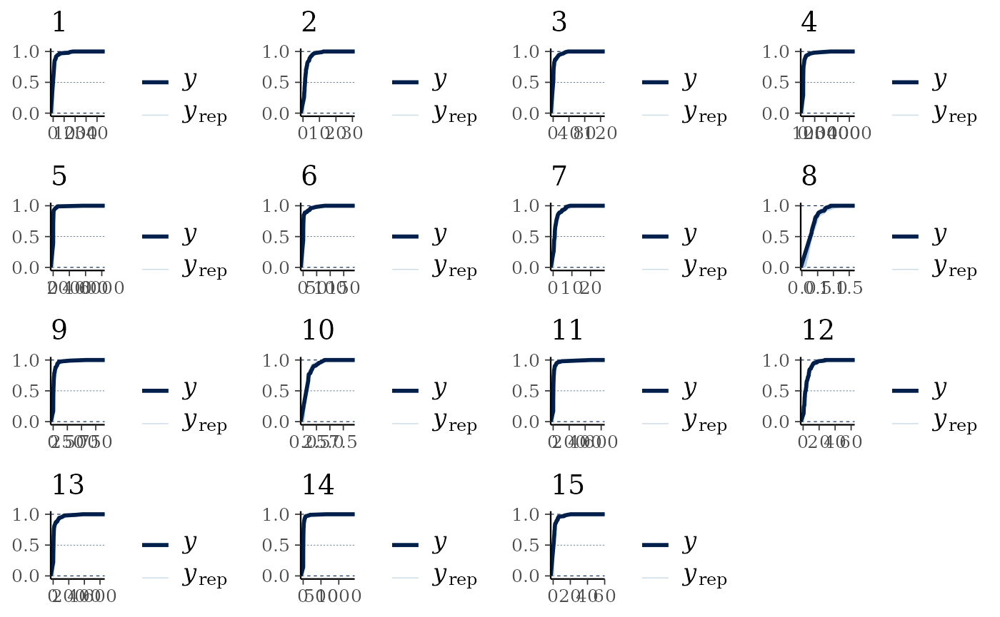
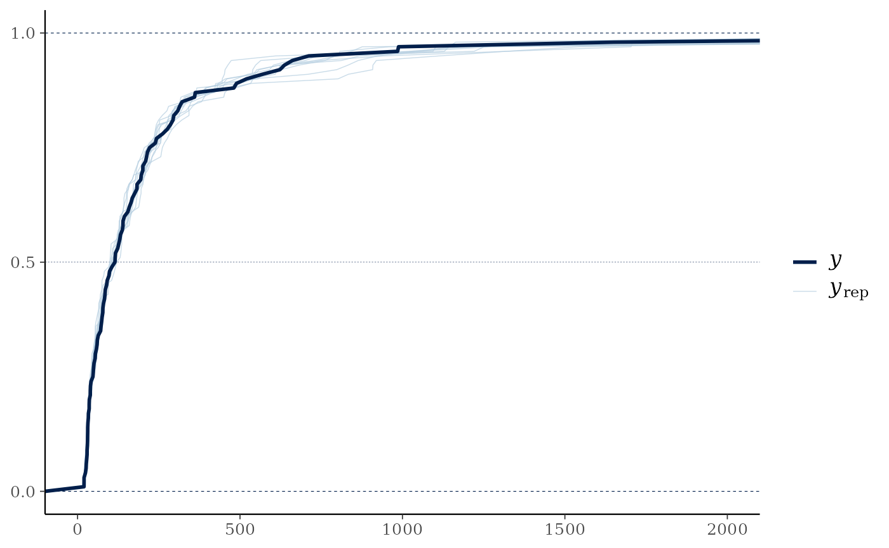
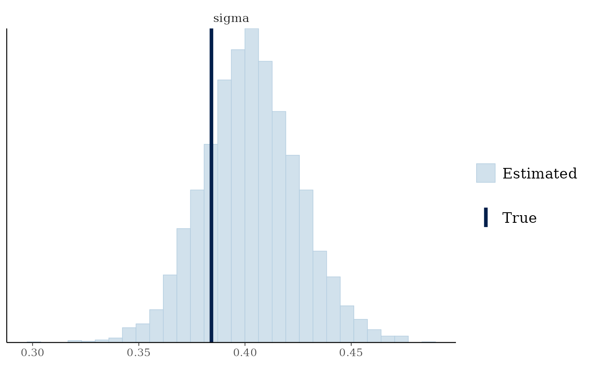
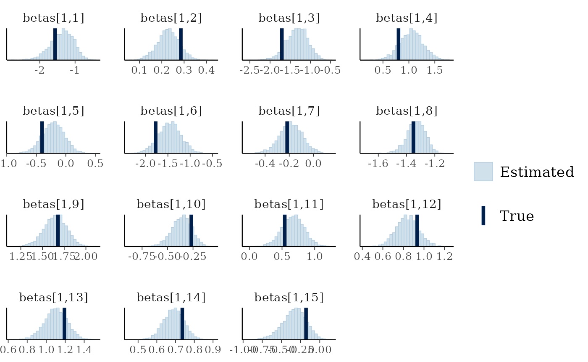
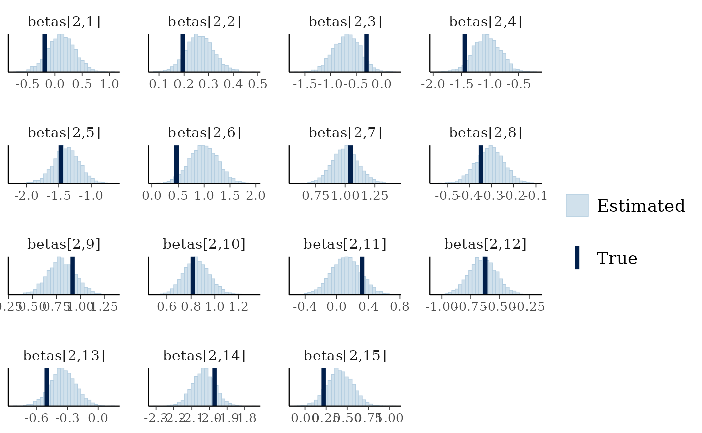
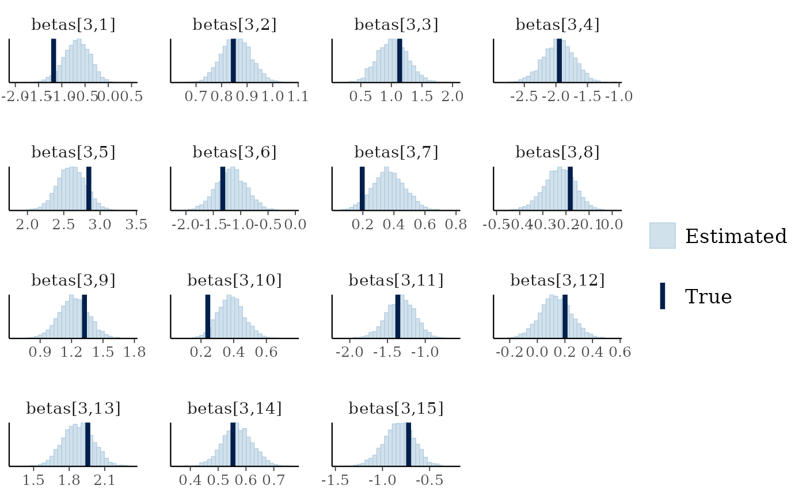
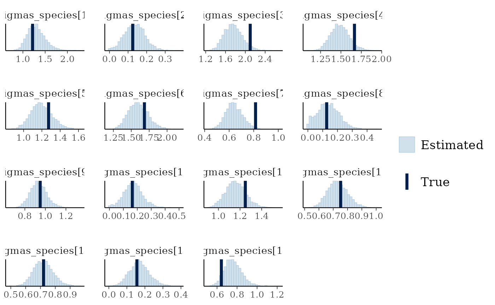

# Modelling censored data

Censored data occurs where the observation falls either below or above
some limit of detection. When the data falls below some limit of
detection this is referred to as left-censoring, while when it falls
above some limit of detection it is referred to as right-censoring.
Interval censoring occurs when you know the upper and lower limit of the
datapoint but not the actual value.

The `jsdmstan` package supports left-censoring in three families, the
Gaussian (or normal) distribution , the lognormal distribution and the
gamma distribution. Data can be simulated with left-censoring, which
will return both the censored and uncensored response matrix. For
fitting censored models, jsdmstan requires a matrix of the reponse plus
an index matrix that says where in the matrix censoring occurs. For
left-censoring the index matrix should be 1 when left-censored or 0 when
not censored.

``` r
library(jsdmstan)
```

## Example with simulated data

First, we can simulate data according to a lognormal distribution:

``` r
set.seed(430150)
cens_dat <- jsdm_sim_data(N = 100, S = 15, K = 2, method = "mglmm", 
                        family = "lognormal", censor = "left", 
                        censor_points = sample(seq(0.05,1,0.05), 15, replace = TRUE))
```

We have to supply the censoring point per species to the data
simulation. In this case we randomly choose those to be between 0.05 and
1.

Now we can fit the model (lowering the number of iterations to improve
runtime):

``` r
cens_mod <- stan_jsdm(dat_list = cens_dat, family = "lognormal", method = "mglmm",
                      censoring = "left", iter = 2000, 
                      control = list(adapt_delta = 0.9))
#> 
#> SAMPLING FOR MODEL 'anon_model' NOW (CHAIN 1).
#> Chain 1: 
#> Chain 1: Gradient evaluation took 0.000409 seconds
#> Chain 1: 1000 transitions using 10 leapfrog steps per transition would take 4.09 seconds.
#> Chain 1: Adjust your expectations accordingly!
#> Chain 1: 
#> Chain 1: 
#> Chain 1: Iteration:    1 / 2000 [  0%]  (Warmup)
#> Chain 1: Iteration:  200 / 2000 [ 10%]  (Warmup)
#> Chain 1: Iteration:  400 / 2000 [ 20%]  (Warmup)
#> Chain 1: Iteration:  600 / 2000 [ 30%]  (Warmup)
#> Chain 1: Iteration:  800 / 2000 [ 40%]  (Warmup)
#> Chain 1: Iteration: 1000 / 2000 [ 50%]  (Warmup)
#> Chain 1: Iteration: 1001 / 2000 [ 50%]  (Sampling)
#> Chain 1: Iteration: 1200 / 2000 [ 60%]  (Sampling)
#> Chain 1: Iteration: 1400 / 2000 [ 70%]  (Sampling)
#> Chain 1: Iteration: 1600 / 2000 [ 80%]  (Sampling)
#> Chain 1: Iteration: 1800 / 2000 [ 90%]  (Sampling)
#> Chain 1: Iteration: 2000 / 2000 [100%]  (Sampling)
#> Chain 1: 
#> Chain 1:  Elapsed Time: 35.179 seconds (Warm-up)
#> Chain 1:                27.934 seconds (Sampling)
#> Chain 1:                63.113 seconds (Total)
#> Chain 1: 
#> 
#> SAMPLING FOR MODEL 'anon_model' NOW (CHAIN 2).
#> Chain 2: 
#> Chain 2: Gradient evaluation took 0.000239 seconds
#> Chain 2: 1000 transitions using 10 leapfrog steps per transition would take 2.39 seconds.
#> Chain 2: Adjust your expectations accordingly!
#> Chain 2: 
#> Chain 2: 
#> Chain 2: Iteration:    1 / 2000 [  0%]  (Warmup)
#> Chain 2: Iteration:  200 / 2000 [ 10%]  (Warmup)
#> Chain 2: Iteration:  400 / 2000 [ 20%]  (Warmup)
#> Chain 2: Iteration:  600 / 2000 [ 30%]  (Warmup)
#> Chain 2: Iteration:  800 / 2000 [ 40%]  (Warmup)
#> Chain 2: Iteration: 1000 / 2000 [ 50%]  (Warmup)
#> Chain 2: Iteration: 1001 / 2000 [ 50%]  (Sampling)
#> Chain 2: Iteration: 1200 / 2000 [ 60%]  (Sampling)
#> Chain 2: Iteration: 1400 / 2000 [ 70%]  (Sampling)
#> Chain 2: Iteration: 1600 / 2000 [ 80%]  (Sampling)
#> Chain 2: Iteration: 1800 / 2000 [ 90%]  (Sampling)
#> Chain 2: Iteration: 2000 / 2000 [100%]  (Sampling)
#> Chain 2: 
#> Chain 2:  Elapsed Time: 35.189 seconds (Warm-up)
#> Chain 2:                27.965 seconds (Sampling)
#> Chain 2:                63.154 seconds (Total)
#> Chain 2: 
#> 
#> SAMPLING FOR MODEL 'anon_model' NOW (CHAIN 3).
#> Chain 3: 
#> Chain 3: Gradient evaluation took 0.000244 seconds
#> Chain 3: 1000 transitions using 10 leapfrog steps per transition would take 2.44 seconds.
#> Chain 3: Adjust your expectations accordingly!
#> Chain 3: 
#> Chain 3: 
#> Chain 3: Iteration:    1 / 2000 [  0%]  (Warmup)
#> Chain 3: Iteration:  200 / 2000 [ 10%]  (Warmup)
#> Chain 3: Iteration:  400 / 2000 [ 20%]  (Warmup)
#> Chain 3: Iteration:  600 / 2000 [ 30%]  (Warmup)
#> Chain 3: Iteration:  800 / 2000 [ 40%]  (Warmup)
#> Chain 3: Iteration: 1000 / 2000 [ 50%]  (Warmup)
#> Chain 3: Iteration: 1001 / 2000 [ 50%]  (Sampling)
#> Chain 3: Iteration: 1200 / 2000 [ 60%]  (Sampling)
#> Chain 3: Iteration: 1400 / 2000 [ 70%]  (Sampling)
#> Chain 3: Iteration: 1600 / 2000 [ 80%]  (Sampling)
#> Chain 3: Iteration: 1800 / 2000 [ 90%]  (Sampling)
#> Chain 3: Iteration: 2000 / 2000 [100%]  (Sampling)
#> Chain 3: 
#> Chain 3:  Elapsed Time: 34.711 seconds (Warm-up)
#> Chain 3:                27.982 seconds (Sampling)
#> Chain 3:                62.693 seconds (Total)
#> Chain 3: 
#> 
#> SAMPLING FOR MODEL 'anon_model' NOW (CHAIN 4).
#> Chain 4: 
#> Chain 4: Gradient evaluation took 0.000244 seconds
#> Chain 4: 1000 transitions using 10 leapfrog steps per transition would take 2.44 seconds.
#> Chain 4: Adjust your expectations accordingly!
#> Chain 4: 
#> Chain 4: 
#> Chain 4: Iteration:    1 / 2000 [  0%]  (Warmup)
#> Chain 4: Iteration:  200 / 2000 [ 10%]  (Warmup)
#> Chain 4: Iteration:  400 / 2000 [ 20%]  (Warmup)
#> Chain 4: Iteration:  600 / 2000 [ 30%]  (Warmup)
#> Chain 4: Iteration:  800 / 2000 [ 40%]  (Warmup)
#> Chain 4: Iteration: 1000 / 2000 [ 50%]  (Warmup)
#> Chain 4: Iteration: 1001 / 2000 [ 50%]  (Sampling)
#> Chain 4: Iteration: 1200 / 2000 [ 60%]  (Sampling)
#> Chain 4: Iteration: 1400 / 2000 [ 70%]  (Sampling)
#> Chain 4: Iteration: 1600 / 2000 [ 80%]  (Sampling)
#> Chain 4: Iteration: 1800 / 2000 [ 90%]  (Sampling)
#> Chain 4: Iteration: 2000 / 2000 [100%]  (Sampling)
#> Chain 4: 
#> Chain 4:  Elapsed Time: 34.397 seconds (Warm-up)
#> Chain 4:                28.091 seconds (Sampling)
#> Chain 4:                62.488 seconds (Total)
#> Chain 4:
#> Warning: Bulk Effective Samples Size (ESS) is too low, indicating posterior means and medians may be unreliable.
#> Running the chains for more iterations may help. See
#> https://mc-stan.org/misc/warnings.html#bulk-ess
#> Warning: Tail Effective Samples Size (ESS) is too low, indicating posterior variances and tail quantiles may be unreliable.
#> Running the chains for more iterations may help. See
#> https://mc-stan.org/misc/warnings.html#tail-ess
cens_mod
#> Family: lognormal 
#>  With parameters: sigma 
#> Model type: mglmm
#>   Number of species: 15
#>   Number of sites: 100
#>   Number of predictors: 3
#> 
#> Model run on 4 chains with 2000 iterations per chain (1000 warmup).
#> 
#> No parameters with Rhat > 1.01 or Neff/N < 0.05
```

No warnings are returned, or anything particularly concerning in terms
of rhat or neff.

Now we can look at the data recovery, specifically comparing the
empirical cumulative distribution function of the data to a random
subset of model draws. The empirical CDF estimates deal better with the
censoring in the original data as opposed to the default smoothed
density kernel estimation.

``` r
multi_pp_check(cens_mod, plotfun = "ecdf_overlay")
#> Using 10 posterior draws for ppc plot type 'ppc_ecdf_overlay' by default.
```



We can see that the data are always nested within the model predictions
(with the exception of the initial jumps due to the censoring, visible
as the straight lines), indicating a reasonable fit to the data.

``` r
pp_check(cens_mod, plotfun="ecdf_overlay") + 
  ggplot2::coord_cartesian(xlim=c(0,2000))
#> Using 10 posterior draws for ppc plot type 'ppc_ecdf_overlay' by default.
```



In this case the distribution of the overall predicted sum across all
variables per site is relatively similar between the raw data and the
model estimates, but in cases where more of the data is censored or just
above the censoring limit this would not necessarily be true in a
well-fitted model.

We can also see if the model did well at recovering the parameters used
within the data simulation:

``` r
mcmc_plot(cens_mod, plotfun = "recover_hist", pars = "sigma",
          true = cens_dat$pars$sigma)
#> `stat_bin()` using `bins = 30`. Pick better value `binwidth`.
```



``` r
mcmc_plot(cens_mod, plotfun = "recover_hist", pars = paste0("betas[1,",1:15,"]"), #regexp = TRUE,
          true = cens_dat$pars$betas[1,])
#> `stat_bin()` using `bins = 30`. Pick better value `binwidth`.
```



``` r
mcmc_plot(cens_mod, plotfun = "recover_hist", pars = paste0("betas[2,",1:15,"]"), #regexp = TRUE,
          true = cens_dat$pars$betas[2,])
#> `stat_bin()` using `bins = 30`. Pick better value `binwidth`.
```



``` r
mcmc_plot(cens_mod, plotfun = "recover_hist", pars = paste0("betas[3,",1:15,"]"), #regexp = TRUE,
          true = cens_dat$pars$betas[3,])
#> `stat_bin()` using `bins = 30`. Pick better value `binwidth`.
```



``` r
mcmc_plot(cens_mod, plotfun = "recover_hist", pars = paste0("sigmas_species[",1:15,"]"), #regexp = TRUE,
          true = cens_dat$pars$sigmas_species)
#> `stat_bin()` using `bins = 30`. Pick better value `binwidth`.
```



Overall the model has performed well at recovering the various
parameters.
