# Introduction to jsdmstan

``` r
library(jsdmstan)
library(ggplot2)
set.seed(8264372)
```

## Joint Species Distribution Models

Joint Species Distibution Models, or jSDMs, are models that model an
entire community of species simultaneously. The idea behind these is
that they allow information to be borrowed across species, such that the
covariance between species can be used to inform the predictions of
distributions of related or commonly co-occurring species.

In plain language (or as plain as I can manage) jSDMs involve the
modelling of an entire species community as a function of some
combination of intercepts, covariate data and species covariance.
Therefore the change of a single species is related to not only change
in the environment but also how it relates to other species. There are
several decisions to be made in how to specify these models - the
standard decisions on which covariates to include, whether each species
should have its own intercept (generally yes) and how to represent
change across sites - but also how to represent the covariance between
species. There are two options for representing this species covariance
in this package. First, the original way of running jSDMs was to model
the entire covariance matrix between species in a multivariate
generalised linear mixed model (MGLMM). However, more recently there
have been methods developed that involve representing the covariance
matrix with a set of linear latent variables - known as generalised
linear latent variable models (GLLVM).

The jsdmstan package aims to provide an interface for fitting these
models in [Stan](https://mc-stan.org/) using the Stan Hamiltonian Monte
Carlo sampling as a robust Bayesian methodology.

### Underlying maths

Feel free to skip this bit if you don’t want to read equations, it is
largely based on Warton et
al. ([2015](http:://doi.org/10.1016/j.tree.2015.09.007)). We model the
community data $m_{ij}$ for each site $i$ and taxon $j$ as a function of
a species intercept, environmental covariates and species covariance
matrix:

$$g\left( m_{ij} \right) = \beta_{0j} + \mathbf{x}_{i}^{\intercal}\beta_{j} + u_{ij}$$

where $g( \cdot )$ is the link function, $\mathbf{x}_{i}^{\intercal}$ is
the transpose of vector $\mathbf{x}$, and for each taxon $j$,
$\beta_{0j}$ is an intercept and $beta_{j}$ is a vector of regression
coefficients related to measured predictors.

A site effect $\alpha_{i}$ can also be added to adjust for total
abundance or richness:

$$g\left( m_{ij} \right) = \alpha_{i} + \beta_{0j} + \mathbf{x}_{i}^{\intercal}\beta_{j} + u_{ij}$$

### Multivariate Generalised Linear Mixed Models

The entire matrix of covariance between species is modelled in MGLMMs.

$$u_{ij} \sim N(\mathbf{0},\mathbf{\Sigma})$$

Fitting the entire covariance matrix means that the amount of time
required to fit these models scales with the number of species cubed,
and the data required scales with the number of species squared. This
makes these models both computationally and data intensive.

### Generalised Linear Latent Variable Models

In response to some of these issues in fitting MGLMMs, GLLVMs were
developed in which $u_{ij}$ is now specified as a linear function of a
set of latent variables $\mathbf{z}_{\mathbf{i}}$:

$$y_{ij}|\mathbf{u}_{i} \sim F\left( m_{ij},\phi_{j} \right)$$$$u_{ij} = \mathbf{z}_{i}^{\intercal}\lambda_{j}$$

The latent variables $\mathbf{z}_{\mathbf{i}}$ are treated as random by
assuming:

$$y_{ij}|\mathbf{z}_{\mathbf{i}} \sim F\left( m_{ij},\phi_{j} \right))$$$$\mathbf{z}_{\mathbf{i}} \sim N(\mathbf{0},\mathbf{1})$$
Treating the species covariance as pulling from a set of latent
variables greatly reduces the computational time required to fit these
models.

### Relationship to environmental covariates

Within jsdmstan the response of species to environmental covariates can
either be unstructured (the default) or constrained by a covariance
matrix between the environmental covariates. This second option
(specified by setting `beta_param = "cor"`) assumes that if one species
is strongly positively related to multiple covariates then it is more
likely that other species will either also be positively related to all
these covariates, or negatively related. Mathematically this corresponds
to:

$$\beta_{j} \sim N(\mathbf{0},\mathbf{\Sigma})$$

## Fitting a MGLMM

First we can use the in-built functions for simulating data according to
the MGLMM model - we’ll choose to simulate 15 species over 200 sites
with 2 environmental covariates. The species are assumed to follow a
Poisson distribution (with a log-link), and we use the defaults of
including a species-specific intercept but no site-specific intercept.
At the moment only default priors (standard normal distribution) are
supported. We can do this using either the
[`jsdm_sim_data()`](https://nerc-ceh.github.io/jsdmstan/reference/jsdm_sim_data.md)
function with `method = "mglmm"` or with the
[`mglmm_sim_data()`](https://nerc-ceh.github.io/jsdmstan/reference/jsdm_sim_data.md)
function which just calls
[`jsdm_sim_data()`](https://nerc-ceh.github.io/jsdmstan/reference/jsdm_sim_data.md)
in the background.

``` r
nsites <- 75
nspecies <- 8
ncovar <- 2
mglmm_test_data <- mglmm_sim_data(N = nsites, S = nspecies, 
                                  K = ncovar, family = "pois")
```

This returns a list, which includes the Y matrix, the X matrix, plus
also the exact parameters used to create the data:

``` r
names(mglmm_test_data)
#> [1] "Y"    "pars" "N"    "S"    "D"    "K"    "X"
dat <- as.data.frame(mglmm_test_data$X)
```

Now, to fit the model we can use the
[`stan_jsdm()`](https://nerc-ceh.github.io/jsdmstan/reference/stan_jsdm.md)
function, which interfaces to Stan through the [rstan
package](https://mc-stan.org/rstan/). There are multiple ways to supply
data to the
[`stan_jsdm()`](https://nerc-ceh.github.io/jsdmstan/reference/stan_jsdm.md)
function, one is to supply the data as a list with the appropriate named
components (the
[`jsdm_sim_data()`](https://nerc-ceh.github.io/jsdmstan/reference/jsdm_sim_data.md)
functions supply data in the correct format already), the second way is
to specify the Y and X matrices directly, and the third way is to use a
formula for the environmental covariates and supply the environmental
data to the `data` argument, which is what we’ll use here:

``` r
mglmm_fit <- stan_jsdm(~ V1 + V2, data = dat, Y = mglmm_test_data$Y, 
                       family = "pois", method = "mglmm", refresh = 0)
```

If we print the model object we will get a brief overview of the type of
jSDM and the data, plus if there are any parameters with Rhat \> 1.01 or
effective sample size ratio (Neff/N) \< 0.05 then they will be printed:

``` r
mglmm_fit
#> Family: poisson 
#>  Model type: mglmm
#>   Number of species: 8
#>   Number of sites: 75
#>   Number of predictors: 0
#> 
#> Model run on 4 chains with 4000 iterations per chain (2000 warmup).
#> 
#> Parameters with Rhat > 1.01, or Neff/N < 0.05:
#>                  mean sd 15% 85% Rhat Bulk.ESS Tail.ESS
#> cor_species[8,8]    1  0   1   1    1     7559     7522
```

To get a summary of all the model parameters we can use
[`summary()`](https://rdrr.io/r/base/summary.html), there are many
parameters in these models so we just include a few here:

``` r
summary(mglmm_fit, pars = "cor_species")
#>                    mean    sd    15%    85%  Rhat Bulk.ESS Tail.ESS
#> cor_species[2,1]  0.118 0.231 -0.109  0.354 1.003     1396     1985
#> cor_species[3,1] -0.225 0.155 -0.389 -0.064 1.003     2192     4145
#> cor_species[4,1]  0.459 0.098  0.355  0.563 1.002     2688     4582
#> cor_species[5,1] -0.185 0.190 -0.381  0.014 1.002     1917     3902
#> cor_species[6,1]  0.046 0.138 -0.096  0.188 1.001     2735     4392
#> cor_species[7,1] -0.111 0.303 -0.428  0.215 1.005      833     1530
#> cor_species[8,1] -0.046 0.296 -0.361  0.268 1.009      885     2190
#> cor_species[1,2]  0.118 0.231 -0.109  0.354 1.003     1396     1985
#> cor_species[2,2]  1.000 0.000  1.000  1.000 1.000     8125       NA
#> cor_species[3,2]  0.050 0.258 -0.216  0.318 1.000     2707     4354
#> cor_species[4,2]  0.384 0.242  0.147  0.623 1.002     1391     1335
#> cor_species[5,2] -0.133 0.280 -0.430  0.161 1.001     2576     4399
#> cor_species[6,2] -0.116 0.272 -0.397  0.167 1.000     2209     3810
#> cor_species[7,2]  0.000 0.311 -0.333  0.335 1.000     3232     5404
#> cor_species[8,2] -0.082 0.310 -0.415  0.253 1.000     3285     4954
#> cor_species[1,3] -0.225 0.155 -0.389 -0.064 1.003     2192     4145
#> cor_species[2,3]  0.050 0.258 -0.216  0.318 1.000     2707     4354
#> cor_species[3,3]  1.000 0.000  1.000  1.000 1.000     7678       NA
#> cor_species[4,3] -0.168 0.154 -0.330 -0.009 1.001     3564     5393
#> cor_species[5,3]  0.240 0.276 -0.050  0.532 1.000     2352     3713
#> cor_species[6,3]  0.148 0.227 -0.088  0.386 1.001     2672     4371
#> cor_species[7,3]  0.054 0.307 -0.274  0.383 1.001     2454     3902
#> cor_species[8,3]  0.040 0.312 -0.292  0.374 1.003     2707     4544
#> cor_species[1,4]  0.459 0.098  0.355  0.563 1.002     2688     4582
#> cor_species[2,4]  0.384 0.242  0.147  0.623 1.002     1391     1335
#> cor_species[3,4] -0.168 0.154 -0.330 -0.009 1.001     3564     5393
#> cor_species[4,4]  1.000 0.000  1.000  1.000 1.000     8123       NA
#> cor_species[5,4] -0.316 0.195 -0.522 -0.110 1.001     2347     4711
#> cor_species[6,4] -0.185 0.136 -0.325 -0.045 1.000     4293     5882
#> cor_species[7,4]  0.005 0.293 -0.302  0.316 1.002     1355     2678
#> cor_species[8,4] -0.130 0.295 -0.438  0.181 1.002     1315     2142
#> cor_species[1,5] -0.185 0.190 -0.381  0.014 1.002     1917     3902
#> cor_species[2,5] -0.133 0.280 -0.430  0.161 1.001     2576     4399
#> cor_species[3,5]  0.240 0.276 -0.050  0.532 1.000     2352     3713
#> cor_species[4,5] -0.316 0.195 -0.522 -0.110 1.001     2347     4711
#> cor_species[5,5]  1.000 0.000  1.000  1.000 1.000     8116     7643
#> cor_species[6,5]  0.372 0.198  0.158  0.583 1.001     3829     5532
#> cor_species[7,5] -0.017 0.314 -0.352  0.327 1.003     2314     4447
#> cor_species[8,5]  0.114 0.301 -0.214  0.434 1.000     3197     4494
#> cor_species[1,6]  0.046 0.138 -0.096  0.188 1.001     2735     4392
#> cor_species[2,6] -0.116 0.272 -0.397  0.167 1.000     2209     3810
#> cor_species[3,6]  0.148 0.227 -0.088  0.386 1.001     2672     4371
#> cor_species[4,6] -0.185 0.136 -0.325 -0.045 1.000     4293     5882
#> cor_species[5,6]  0.372 0.198  0.158  0.583 1.001     3829     5532
#> cor_species[6,6]  1.000 0.000  1.000  1.000 1.000     7519       NA
#> cor_species[7,6]  0.040 0.315 -0.301  0.377 1.001     1951     4334
#> cor_species[8,6]  0.162 0.289 -0.148  0.463 1.001     2117     3104
#> cor_species[1,7] -0.111 0.303 -0.428  0.215 1.005      833     1530
#> cor_species[2,7]  0.000 0.311 -0.333  0.335 1.000     3232     5404
#> cor_species[3,7]  0.054 0.307 -0.274  0.383 1.001     2454     3902
#> cor_species[4,7]  0.005 0.293 -0.302  0.316 1.002     1355     2678
#> cor_species[5,7] -0.017 0.314 -0.352  0.327 1.003     2314     4447
#> cor_species[6,7]  0.040 0.315 -0.301  0.377 1.001     1951     4334
#> cor_species[7,7]  1.000 0.000  1.000  1.000 1.001     8108       NA
#> cor_species[8,7]  0.006 0.320 -0.340  0.355 1.001     4288     6252
#> cor_species[1,8] -0.046 0.296 -0.361  0.268 1.009      885     2190
#> cor_species[2,8] -0.082 0.310 -0.415  0.253 1.000     3285     4954
#> cor_species[3,8]  0.040 0.312 -0.292  0.374 1.003     2707     4544
#> cor_species[4,8] -0.130 0.295 -0.438  0.181 1.002     1315     2142
#> cor_species[5,8]  0.114 0.301 -0.214  0.434 1.000     3197     4494
#> cor_species[6,8]  0.162 0.289 -0.148  0.463 1.001     2117     3104
#> cor_species[7,8]  0.006 0.320 -0.340  0.355 1.001     4288     6252
#> cor_species[8,8]  1.000 0.000  1.000  1.000 1.000     7559     7522
```

To get a better overview of the R-hat and effective sample size we can
use the
[`mcmc_plot()`](https://nerc-ceh.github.io/jsdmstan/reference/mcmc_plot.jsdmStanFit.md)
function to plot histograms of R-hat and ESS.

``` r
mcmc_plot(mglmm_fit, plotfun = "rhat_hist")
#> `stat_bin()` using `bins = 30`. Pick better value `binwidth`.
```

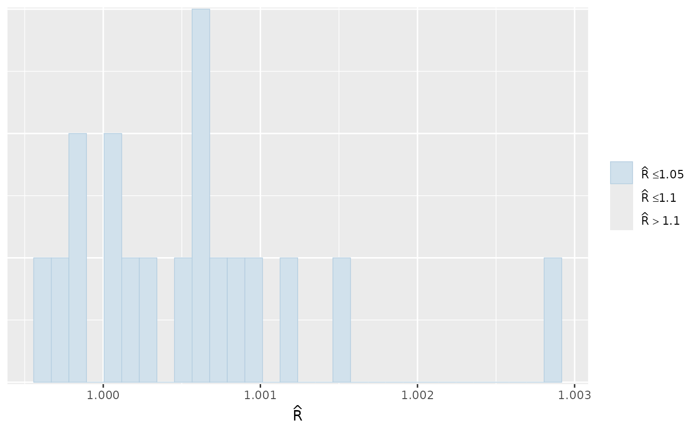

``` r
mcmc_plot(mglmm_fit, plotfun = "neff_hist")
#> Warning: Dropped 1 NAs from 'new_neff_ratio(ratio)'.
#> `stat_bin()` using `bins = 30`. Pick better value `binwidth`.
```

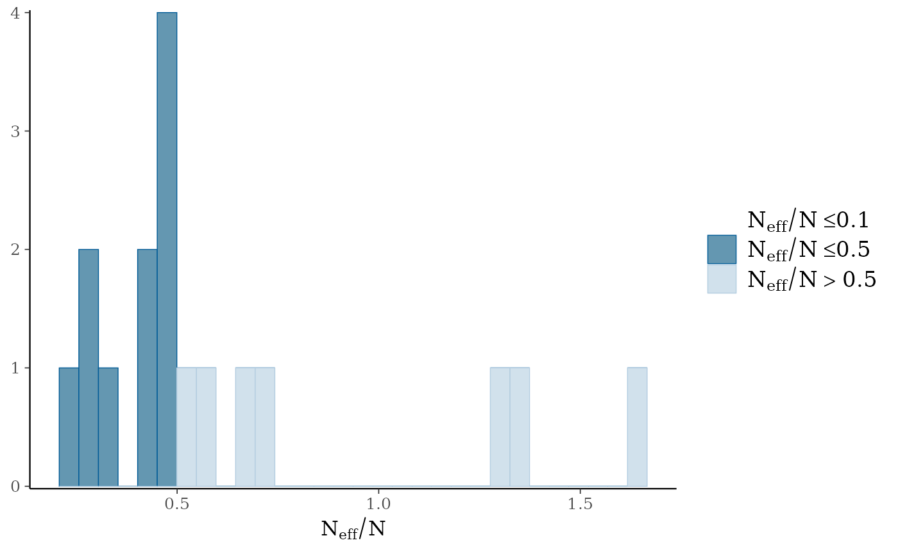

We can also examine the output for each parameter visually using a
traceplot combined with a density plot, which is given by the default
[`plot()`](https://rdrr.io/r/graphics/plot.default.html) command:

``` r
plot(mglmm_fit, ask = FALSE)
```

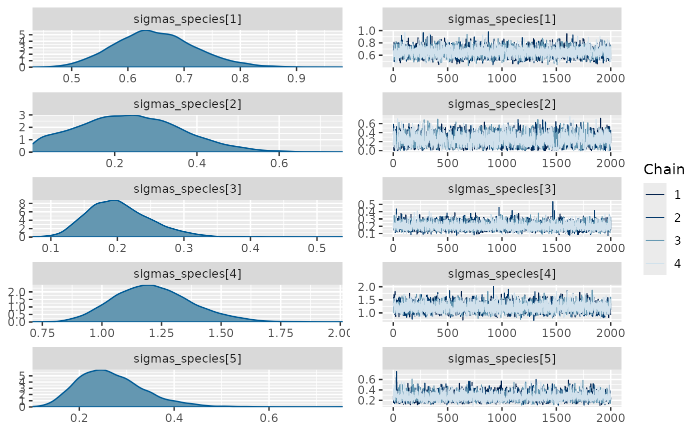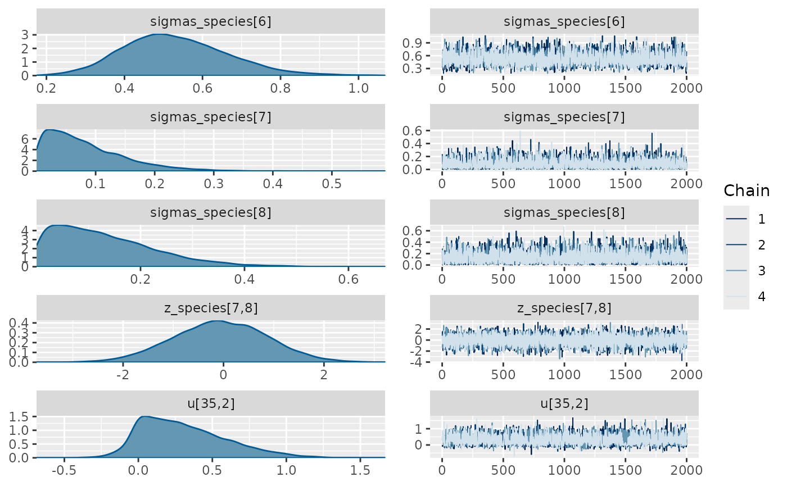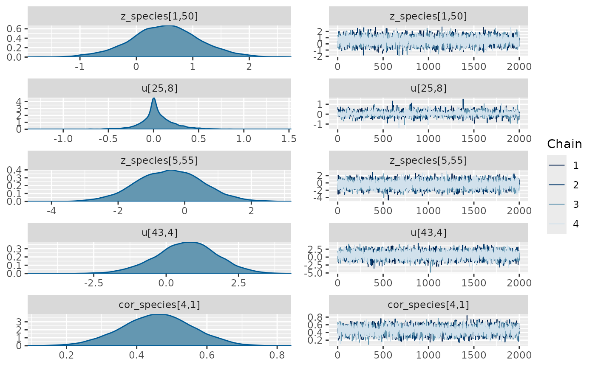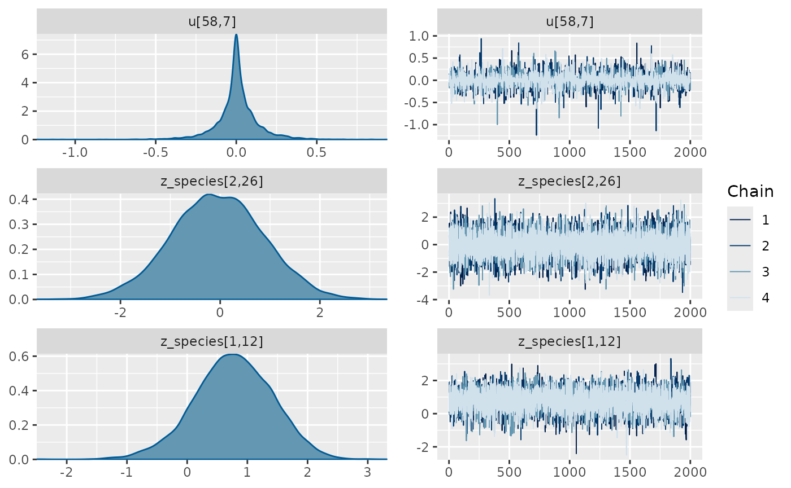

By default the [`plot()`](https://rdrr.io/r/graphics/plot.default.html)
command plots all of the parameters with sigma or kappa in their name
plus a random selection of 20 other parameters, but this can be
overridden by either specifying the parameters by name (with or without
regular expression matching) or changing the number of parameters to be
randomly sampled. Use the
[`get_parnames()`](https://nerc-ceh.github.io/jsdmstan/reference/jsdmstan-extractors.md)
function to get the names of parameters within a model - and the
[`jsdm_stancode()`](https://nerc-ceh.github.io/jsdmstan/reference/jsdm_stancode.md)
function can also be used to see the underlying structure of the model.

All the mcmc plot types within bayesplot are supported by the
[`mcmc_plot()`](https://nerc-ceh.github.io/jsdmstan/reference/mcmc_plot.jsdmStanFit.md)
function, and to see a full list either use
[`bayesplot::available_mcmc()`](https://mc-stan.org/bayesplot/reference/available_ppc.html)
or run
[`mcmc_plot()`](https://nerc-ceh.github.io/jsdmstan/reference/mcmc_plot.jsdmStanFit.md)
with an incorrect type and the options will be printed.

We can also view the environmental effect parameters for each species
using the
[`envplot()`](https://nerc-ceh.github.io/jsdmstan/reference/envplot.md)
function.

``` r
envplot(mglmm_fit)
```

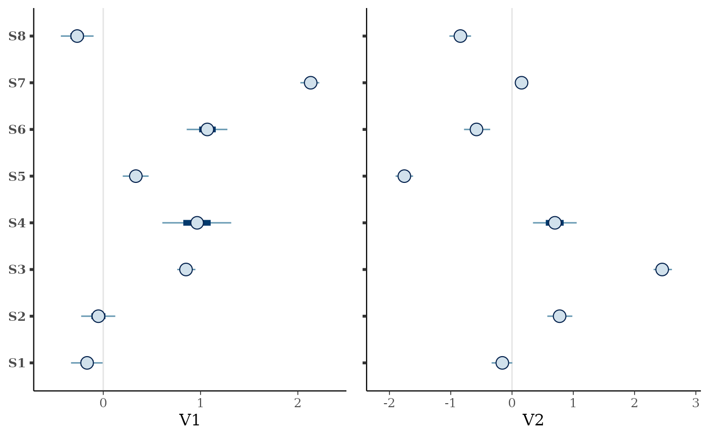

Posterior predictions can be extracted from the models using either
[`posterior_linpred()`](https://nerc-ceh.github.io/jsdmstan/reference/posterior_linpred.jsdmStanFit.md)
or
[`posterior_predict()`](https://nerc-ceh.github.io/jsdmstan/reference/posterior_predict.jsdmStanFit.md),
where the linpred function extracts the linear predictor for the
community composition within each draw and the predict function combines
this linear predictor extraction with a random generation based on the
predicted probability for the family. Both functions by default return a
list of length equal to the number of draws extracted, where each
element of the list is a sites by species matrix.

``` r
mglmm_pp <- posterior_predict(mglmm_fit)
length(mglmm_pp)
#> [1] 8000
dim(mglmm_pp[[1]])
#> [1] 75  8
```

As well as the MCMC plotting functions within bayesplot the ppc\_ family
of functions is also supported through the
[`pp_check()`](https://nerc-ceh.github.io/jsdmstan/reference/pp_check.jsdmStanFit.md)
function. This family of functions provides a graphical way to check
your posterior against the data used within the model to evaluate model
fit - called a posterior retrodictive check (or posterior predictive
historically and when the prior only has been sampled from). To use
these you need to have set `save_data = TRUE` within the
[`stan_jsdm()`](https://nerc-ceh.github.io/jsdmstan/reference/stan_jsdm.md)
call. Unlike in other packages by default
[`pp_check()`](https://nerc-ceh.github.io/jsdmstan/reference/pp_check.jsdmStanFit.md)
for `jsdmStanFit` objects extracts the posterior predictions then
calculates summary statistics over the rows and plots those summary
statistics against the same for the original data. The default behaviour
is to calculate the sum of all the species per site - i.e. total
abundance.

``` r
pp_check(mglmm_fit)
#> Using 10 posterior draws for ppc plot type 'ppc_dens_overlay' by default.
```

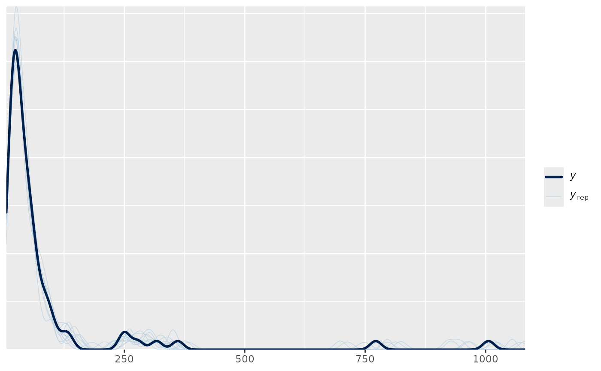

The summary statistic can be changed, as can whether it is calculated
for every species or every site:

``` r
pp_check(mglmm_fit, summary_stat = "mean", calc_over = "species",
         plotfun = "ecdf_overlay")
#> Using 10 posterior draws for ppc plot type 'ppc_ecdf_overlay' by default.
```

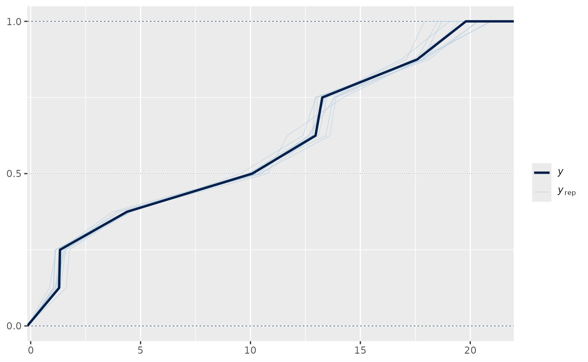

We can examine the species-specific posterior predictive check through
using
[`multi_pp_check()`](https://nerc-ceh.github.io/jsdmstan/reference/multi_pp_check.md),
or examine how well the relationships between specific species are
recovered using
[`pp_check()`](https://nerc-ceh.github.io/jsdmstan/reference/pp_check.jsdmStanFit.md)
with `plotfun = "pairs"`.

As we have run the above model on simulated data and the original data
list contains the parameters used to simulate the data we can use the
`mcmc_recover_` functions from `bayesplot` to see how the model did:

``` r
mcmc_plot(mglmm_fit, plotfun = "recover_hist",
          pars = paste0("sigmas_species[",1:8,"]"),
          true = mglmm_test_data$pars$sigmas_species)
#> `stat_bin()` using `bins = 30`. Pick better value `binwidth`.
```

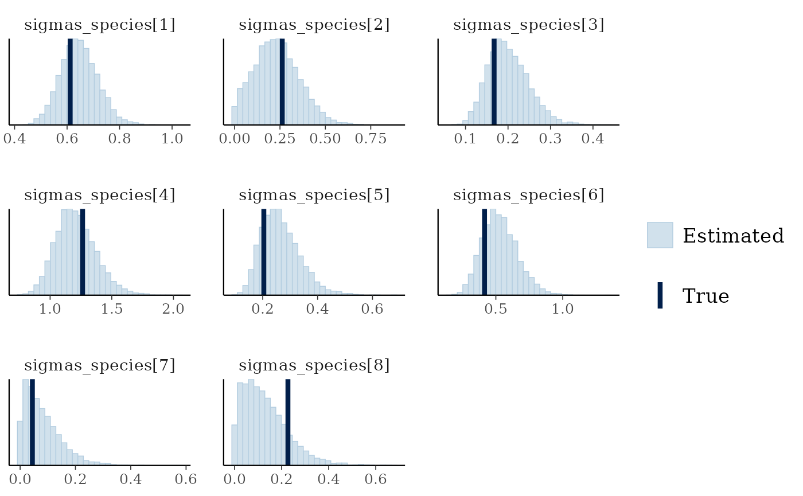

``` r
mcmc_plot(mglmm_fit, plotfun = "recover_intervals",
          pars = paste0("cor_species[",rep(1:nspecies, nspecies:1),",",
                        unlist(sapply(1:8, ":",8)),"]"),
          true = c(mglmm_test_data$pars$cor_species[lower.tri(mglmm_test_data$pars$cor_species, diag = TRUE)])) +
  theme(axis.text.x = element_text(angle = 90))
```

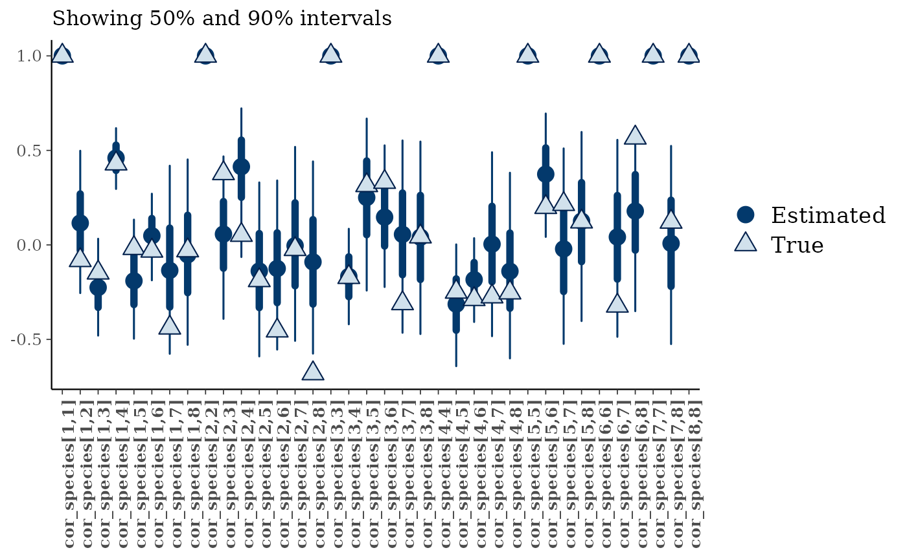

## Fitting a GLLVM

The model fitting workflow for latent variable models is very similar to
that above, with the addition of specifying the number of latent
variables (D) in the data simulation and model fit. Here we change the
family to a Bernoulli family (i.e. the special case of the binomial
where the number of trials is 1 for all observations), make the
covariate effects on each species draw from a correlation matrix such
that information can be shared across species, and change the prior to
be a Student’s T prior on the predictor-specific sigma parameter.

``` r
set.seed(3562251)
gllvm_data <- gllvm_sim_data(N = 50, S = 12, D = 2, K = 1,
                             family = "bernoulli",
                             beta_param = "cor",
                             prior = jsdm_prior(sigmas_preds = "student_t(3,0,1)"))
```

``` r
gllvm_fit <- stan_jsdm(Y = gllvm_data$Y, X = gllvm_data$X,
                       D = gllvm_data$D,  
                       family = "bernoulli",
                       method = "gllvm", 
                       beta_param = "cor",
                       prior = jsdm_prior(sigmas_preds = "student_t(3,0,1)"),
                       refresh = 0)
gllvm_fit
#> Family: bernoulli 
#>  Model type: gllvm with 2 latent variables
#>   Number of species: 12
#>   Number of sites: 50
#>   Number of predictors: 0
#> 
#> Model run on 4 chains with 4000 iterations per chain (2000 warmup).
#> 
#> No parameters with Rhat > 1.01 or Neff/N < 0.05
```

Again, the diagnostic statistics seem reasonable:

``` r
mcmc_plot(gllvm_fit, plotfun = "rhat_hist")
#> Warning: Dropped 1 NAs from 'new_rhat(rhat)'.
#> `stat_bin()` using `bins = 30`. Pick better value `binwidth`.
```

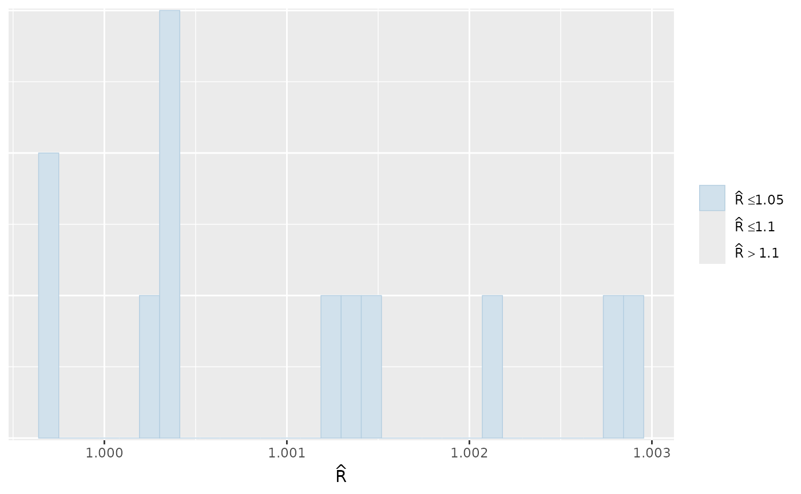

``` r
mcmc_plot(gllvm_fit, plotfun = "neff_hist")
#> `stat_bin()` using `bins = 30`. Pick better value `binwidth`.
```

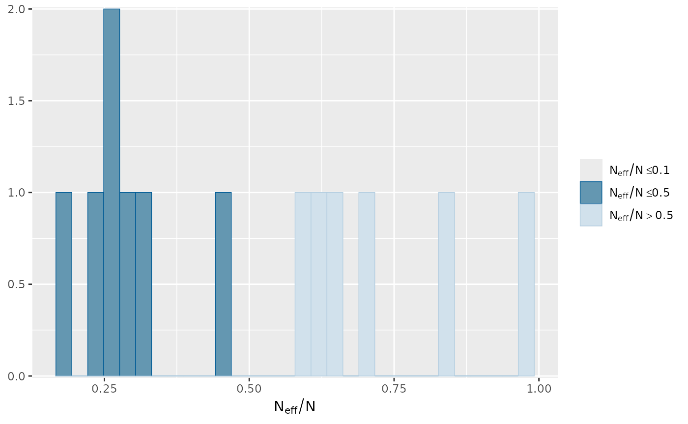

For brevity’s sake we will not go into the detail of the different
functions again here, however there is one plotting function
specifically for GLLVM models -
[`ordiplot()`](https://nerc-ceh.github.io/jsdmstan/reference/ordiplot.md).
This plots the species or sites scores against the latent variables from
a random selection of draws:

``` r
ordiplot(gllvm_fit, errorbar_range = 0.5)
```

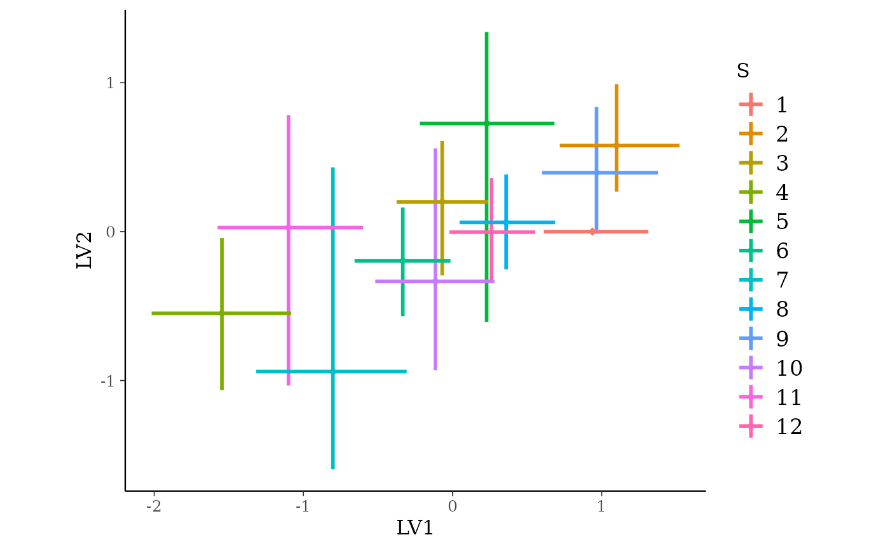

``` r
ordiplot(gllvm_fit, type = "sites", geom = "text", errorbar_range = 0) +
  theme(legend.position = "none")
```

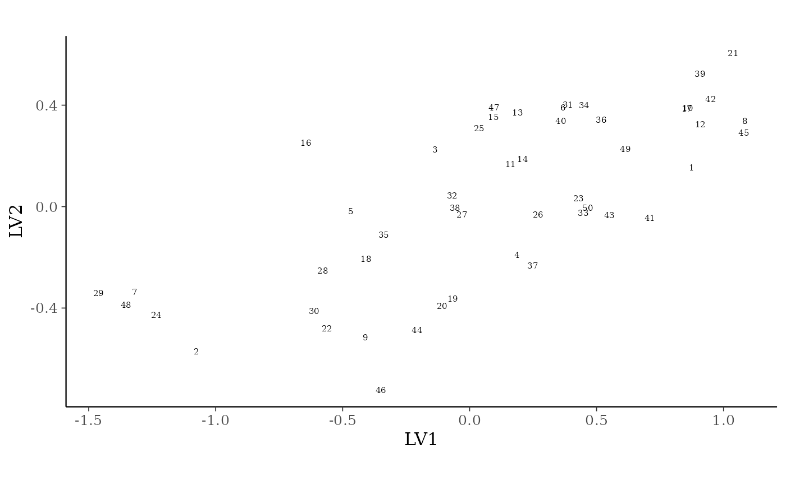

You can change the latent variables selected by specifying the `choices`
argument, and alter the number of draws or whether you want to plot
species or sites with the other arguments.

## References

Warton et al (2015) So many variables: joint modeling in community
ecology. Trends in Ecology & Evolution, 30:766-779. DOI:
[10.1016/j.tree.2015.09.007](http:://doi.org/10.1016/j.tree.2015.09.007).

Wilkinson et al (2021) Defining and evaluating predictions of joint
species distribution models. Methods in Ecology and Evolution,
12:394-404. DOI:
[10.1111/2041-210X.13518](http:://doi.org/10.1111/2041-210X.13518).

Vehtari, A., Gelman, A., and Gabry, J. (2017). Practical Bayesian model
evaluation using leave-one-out cross-validation and WAIC. Statistics and
Computing. 27(5), 1413–1432. DOI:
[10.1007/s11222-016-9696-4](http::doi.org/10.1007/s11222-016-9696-4).
