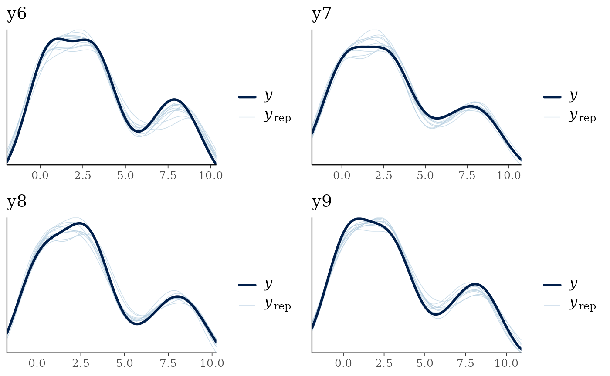
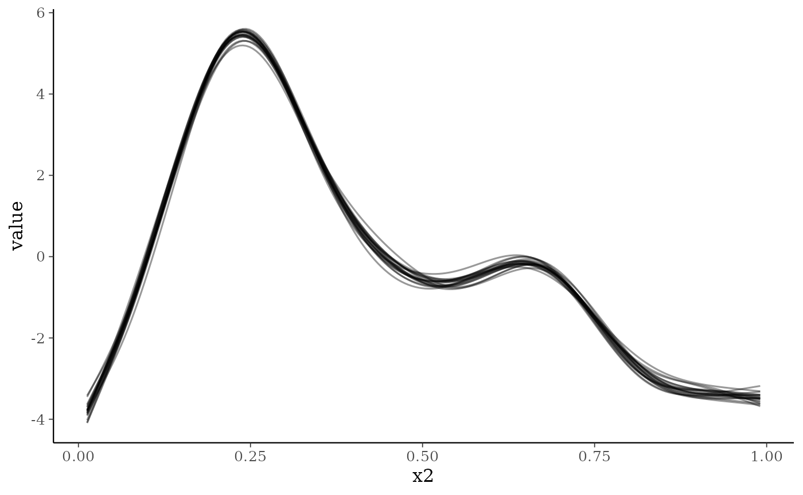
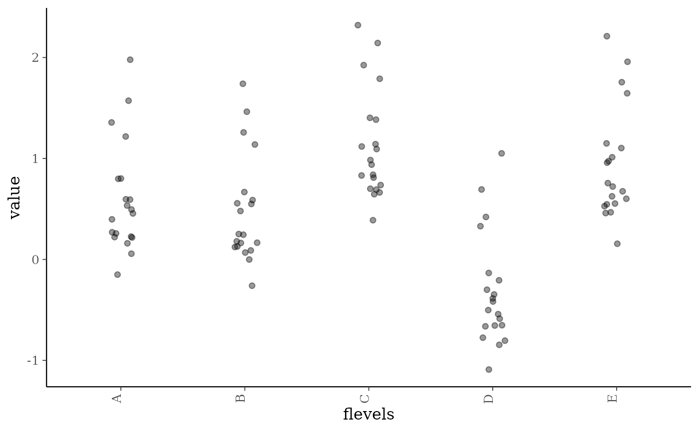
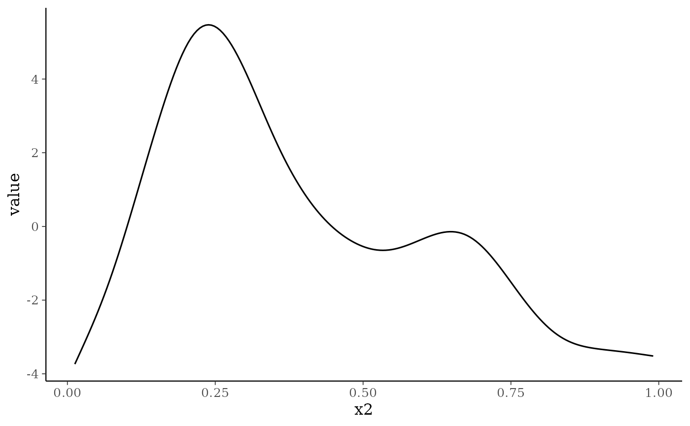
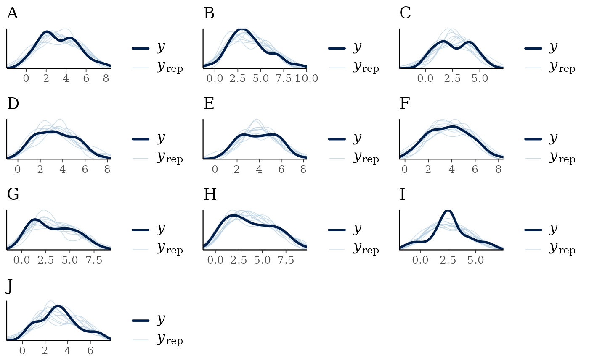
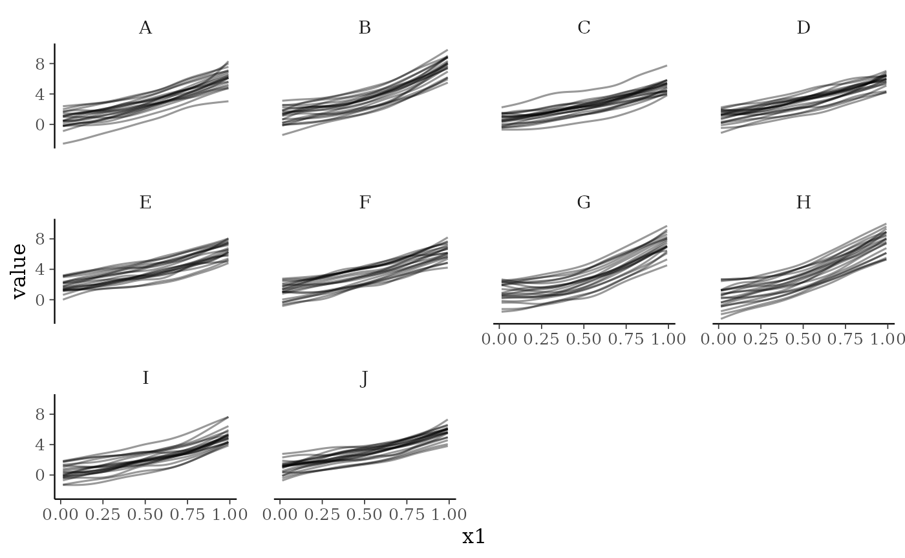

# Fitting generalised additive models within jsdmstan

``` r
library(jsdmstan)
```

## Background

The `jsdmstan` package supports the fitting of non-linear and random
effects through using the generalised additive modelling (GAM) approach
as represented within the `mgcv` R package (available on
[CRAN](https://cran.r-project.org/package=mgcv); Wood, 2011). See [Wood
(2025)](https://doi.org/10.1146/annurev-statistics-112723-034249) for an
overview of the GAM method. This means that the user can specify splines
by using the formula argument to
[`stan_jsdm()`](https://nerc-ceh.github.io/jsdmstan/reference/stan_jsdm.md)
and including an `s()` call within that formula to specify the spline
structure. This can be done either at the site-level (where multiple
basis functions are supported) or at the species-level by fitting a
factor-smooth to species. Examples of this in practice are shown below.

## Site-specific splines

``` r
# 2 spline nfs testing ####
set.seed(2)
dat <- mgcv::gamSim(1,n=100,dist="normal",scale=2)
#> Gu & Wahba 4 term additive model
dat$flevels <- as.factor(rep(LETTERS[1:5],each=20))
dat$fvals <- rep(rnorm(5, sd = .5),each=20)

dat$y6 <- dat$f2 + dat$fvals + rnorm(100, sd=.5)
dat$y7 <- dat$f2 + dat$fvals + rnorm(100, sd=.5)
dat$y8 <- dat$f2 + dat$fvals + rnorm(100, sd=.5)
dat$y9 <- dat$f2 + dat$fvals + rnorm(100, sd=.5)

Y <- dat[,c("y6","y7","y8","y9")]
```

Model fit, specifying priors for beta (representing the intercept only,
in this case) based upon the data:

``` r
nfs_fit <- stan_jsdm(~s(x2) + s(flevels, bs = "re"), data = dat,
                     Y = Y, family ="gaussian", method = "mglmm",
                     prior = jsdm_prior(betas = "normal(3,1)"),
                     iter = 1000)
#> 
#> SAMPLING FOR MODEL 'anon_model' NOW (CHAIN 1).
#> Chain 1: 
#> Chain 1: Gradient evaluation took 0.000158 seconds
#> Chain 1: 1000 transitions using 10 leapfrog steps per transition would take 1.58 seconds.
#> Chain 1: Adjust your expectations accordingly!
#> Chain 1: 
#> Chain 1: 
#> Chain 1: Iteration:   1 / 1000 [  0%]  (Warmup)
#> Chain 1: Iteration: 100 / 1000 [ 10%]  (Warmup)
#> Chain 1: Iteration: 200 / 1000 [ 20%]  (Warmup)
#> Chain 1: Iteration: 300 / 1000 [ 30%]  (Warmup)
#> Chain 1: Iteration: 400 / 1000 [ 40%]  (Warmup)
#> Chain 1: Iteration: 500 / 1000 [ 50%]  (Warmup)
#> Chain 1: Iteration: 501 / 1000 [ 50%]  (Sampling)
#> Chain 1: Iteration: 600 / 1000 [ 60%]  (Sampling)
#> Chain 1: Iteration: 700 / 1000 [ 70%]  (Sampling)
#> Chain 1: Iteration: 800 / 1000 [ 80%]  (Sampling)
#> Chain 1: Iteration: 900 / 1000 [ 90%]  (Sampling)
#> Chain 1: Iteration: 1000 / 1000 [100%]  (Sampling)
#> Chain 1: 
#> Chain 1:  Elapsed Time: 9.359 seconds (Warm-up)
#> Chain 1:                9.889 seconds (Sampling)
#> Chain 1:                19.248 seconds (Total)
#> Chain 1: 
#> 
#> SAMPLING FOR MODEL 'anon_model' NOW (CHAIN 2).
#> Chain 2: 
#> Chain 2: Gradient evaluation took 9.5e-05 seconds
#> Chain 2: 1000 transitions using 10 leapfrog steps per transition would take 0.95 seconds.
#> Chain 2: Adjust your expectations accordingly!
#> Chain 2: 
#> Chain 2: 
#> Chain 2: Iteration:   1 / 1000 [  0%]  (Warmup)
#> Chain 2: Iteration: 100 / 1000 [ 10%]  (Warmup)
#> Chain 2: Iteration: 200 / 1000 [ 20%]  (Warmup)
#> Chain 2: Iteration: 300 / 1000 [ 30%]  (Warmup)
#> Chain 2: Iteration: 400 / 1000 [ 40%]  (Warmup)
#> Chain 2: Iteration: 500 / 1000 [ 50%]  (Warmup)
#> Chain 2: Iteration: 501 / 1000 [ 50%]  (Sampling)
#> Chain 2: Iteration: 600 / 1000 [ 60%]  (Sampling)
#> Chain 2: Iteration: 700 / 1000 [ 70%]  (Sampling)
#> Chain 2: Iteration: 800 / 1000 [ 80%]  (Sampling)
#> Chain 2: Iteration: 900 / 1000 [ 90%]  (Sampling)
#> Chain 2: Iteration: 1000 / 1000 [100%]  (Sampling)
#> Chain 2: 
#> Chain 2:  Elapsed Time: 11.919 seconds (Warm-up)
#> Chain 2:                10.311 seconds (Sampling)
#> Chain 2:                22.23 seconds (Total)
#> Chain 2: 
#> 
#> SAMPLING FOR MODEL 'anon_model' NOW (CHAIN 3).
#> Chain 3: 
#> Chain 3: Gradient evaluation took 8.9e-05 seconds
#> Chain 3: 1000 transitions using 10 leapfrog steps per transition would take 0.89 seconds.
#> Chain 3: Adjust your expectations accordingly!
#> Chain 3: 
#> Chain 3: 
#> Chain 3: Iteration:   1 / 1000 [  0%]  (Warmup)
#> Chain 3: Iteration: 100 / 1000 [ 10%]  (Warmup)
#> Chain 3: Iteration: 200 / 1000 [ 20%]  (Warmup)
#> Chain 3: Iteration: 300 / 1000 [ 30%]  (Warmup)
#> Chain 3: Iteration: 400 / 1000 [ 40%]  (Warmup)
#> Chain 3: Iteration: 500 / 1000 [ 50%]  (Warmup)
#> Chain 3: Iteration: 501 / 1000 [ 50%]  (Sampling)
#> Chain 3: Iteration: 600 / 1000 [ 60%]  (Sampling)
#> Chain 3: Iteration: 700 / 1000 [ 70%]  (Sampling)
#> Chain 3: Iteration: 800 / 1000 [ 80%]  (Sampling)
#> Chain 3: Iteration: 900 / 1000 [ 90%]  (Sampling)
#> Chain 3: Iteration: 1000 / 1000 [100%]  (Sampling)
#> Chain 3: 
#> Chain 3:  Elapsed Time: 10.762 seconds (Warm-up)
#> Chain 3:                10.29 seconds (Sampling)
#> Chain 3:                21.052 seconds (Total)
#> Chain 3: 
#> 
#> SAMPLING FOR MODEL 'anon_model' NOW (CHAIN 4).
#> Chain 4: 
#> Chain 4: Gradient evaluation took 9.3e-05 seconds
#> Chain 4: 1000 transitions using 10 leapfrog steps per transition would take 0.93 seconds.
#> Chain 4: Adjust your expectations accordingly!
#> Chain 4: 
#> Chain 4: 
#> Chain 4: Iteration:   1 / 1000 [  0%]  (Warmup)
#> Chain 4: Iteration: 100 / 1000 [ 10%]  (Warmup)
#> Chain 4: Iteration: 200 / 1000 [ 20%]  (Warmup)
#> Chain 4: Iteration: 300 / 1000 [ 30%]  (Warmup)
#> Chain 4: Iteration: 400 / 1000 [ 40%]  (Warmup)
#> Chain 4: Iteration: 500 / 1000 [ 50%]  (Warmup)
#> Chain 4: Iteration: 501 / 1000 [ 50%]  (Sampling)
#> Chain 4: Iteration: 600 / 1000 [ 60%]  (Sampling)
#> Chain 4: Iteration: 700 / 1000 [ 70%]  (Sampling)
#> Chain 4: Iteration: 800 / 1000 [ 80%]  (Sampling)
#> Chain 4: Iteration: 900 / 1000 [ 90%]  (Sampling)
#> Chain 4: Iteration: 1000 / 1000 [100%]  (Sampling)
#> Chain 4: 
#> Chain 4:  Elapsed Time: 11.686 seconds (Warm-up)
#> Chain 4:                10.389 seconds (Sampling)
#> Chain 4:                22.075 seconds (Total)
#> Chain 4:
#> Warning: Bulk Effective Samples Size (ESS) is too low, indicating posterior means and medians may be unreliable.
#> Running the chains for more iterations may help. See
#> https://mc-stan.org/misc/warnings.html#bulk-ess
#> Warning: Tail Effective Samples Size (ESS) is too low, indicating posterior variances and tail quantiles may be unreliable.
#> Running the chains for more iterations may help. See
#> https://mc-stan.org/misc/warnings.html#tail-ess
```

There’s a couple of warnings on ESS, so we’ll check to see what is going
on by printing the model object to the console:

``` r
nfs_fit
#> Family: gaussian 
#>  With parameters: sigma 
#> Model type: mglmm
#>   Number of species: 4
#>   Number of sites: 100
#>   Number of predictors: 0
#> 
#> Model run on 4 chains with 1000 iterations per chain (500 warmup).
#> 
#> Parameters with Rhat > 1.01, or Neff/N < 0.05:
#>          mean     sd      15%      85% Rhat Bulk.ESS Tail.ESS
#> lp__ -134.182 23.739 -158.558 -110.844 1.01      285      384
```

There are several parameters with ESS \< 500, but the ESS is always over
400 which should be fine for our purposes. Now we can look at model
recovery of the data, using the standard jsdmstan functions. We’ll just
take a look to see if the model recovers the individual species
distributions:

``` r
multi_pp_check(nfs_fit)
#> Using 10 posterior draws for ppc plot type 'ppc_dens_overlay' by default.
```



The model seems to recover the data well. We can also plot out the
smooth effects using the
[`smoothplot()`](https://nerc-ceh.github.io/jsdmstan/reference/smoothplot.md)
function. This returns a list of ggplot2 objects including plots for
each smooth fitted. For smooths such as the default thin-plate
regression spline or e.g. a cyclic cubic regression spline this will
take the form of a series of lines representing different draws from the
model. For random effect splines this takes the form of a jittered point
plot of the random effect values plotted against the random effect
categories. The number of draws can be varied, and a summary line added
to the line plots if required.

``` r
smoothplot(nfs_fit)
#> [[1]]
```



    #> 
    #> [[2]]



To demonstrate some of the smoothplot options, here we’ll plot the
average smooth from 1000 draws for the first smooth (not the random
effect):

``` r
smoothplot(nfs_fit, summarise = mean, ndraws = 1000, 
           select_smooths = list(site = 1))
#> [[1]]
```



## Species- and site-specific factor smooths

Simulate data, based upon the factor-smooth example in the
[`mgcv::gam()`](https://rdrr.io/pkg/mgcv/man/gam.html) documentation:

``` r
set.seed(0)
## simulate data...
f1 <- function(x,a=2,b=-1) exp(a * x)+b
n <- 500;nf <- 6
fac <- as.factor(rep(LETTERS[1:nf],each=50))
x1 <- rep(runif(50),nf)
a <- rnorm(nf)*.2 + 2;b <- rnorm(nf)*.5
f <- f1(x1,a[fac],b[fac])
fac <- factor(fac)
y <- f + rnorm(n)
#> Warning in f + rnorm(n): longer object length is not a multiple of shorter
#> object length
```

So response depends on a smooth of x1 for each level of fac, which we
now convert the data into wide format:

``` r
df <- data.frame(x1 = x1[1:50])
Y <- matrix(y, nrow = 50)
colnames(Y) <- LETTERS[1:10]
```

We fit the model by specifying `species` as the factor within a
factor-smooth model. Species doesn’t need to be in the original
dataframe (and obviously cannot be!) as `jsdmstan` recognises what is
going on and sorts it all out under the hood. Note that if `species` is
a column name in the original dataframe it will be ignored and instead
the model fit to vary across the columns of Y. Specifying any other
column name as the factor within the factor-smooth means that jsdmstan
will fit a site-specific factor instead.

``` r
fs1_fit <- stan_jsdm(~s(x1, species, bs = "fs"), data = df, Y = Y,
                     family = "gaussian", method = "mglmm", iter = 1000)
#> 
#> SAMPLING FOR MODEL 'anon_model' NOW (CHAIN 1).
#> Chain 1: 
#> Chain 1: Gradient evaluation took 0.001473 seconds
#> Chain 1: 1000 transitions using 10 leapfrog steps per transition would take 14.73 seconds.
#> Chain 1: Adjust your expectations accordingly!
#> Chain 1: 
#> Chain 1: 
#> Chain 1: Iteration:   1 / 1000 [  0%]  (Warmup)
#> Chain 1: Iteration: 100 / 1000 [ 10%]  (Warmup)
#> Chain 1: Iteration: 200 / 1000 [ 20%]  (Warmup)
#> Chain 1: Iteration: 300 / 1000 [ 30%]  (Warmup)
#> Chain 1: Iteration: 400 / 1000 [ 40%]  (Warmup)
#> Chain 1: Iteration: 500 / 1000 [ 50%]  (Warmup)
#> Chain 1: Iteration: 501 / 1000 [ 50%]  (Sampling)
#> Chain 1: Iteration: 600 / 1000 [ 60%]  (Sampling)
#> Chain 1: Iteration: 700 / 1000 [ 70%]  (Sampling)
#> Chain 1: Iteration: 800 / 1000 [ 80%]  (Sampling)
#> Chain 1: Iteration: 900 / 1000 [ 90%]  (Sampling)
#> Chain 1: Iteration: 1000 / 1000 [100%]  (Sampling)
#> Chain 1: 
#> Chain 1:  Elapsed Time: 67.787 seconds (Warm-up)
#> Chain 1:                42.232 seconds (Sampling)
#> Chain 1:                110.019 seconds (Total)
#> Chain 1: 
#> 
#> SAMPLING FOR MODEL 'anon_model' NOW (CHAIN 2).
#> Chain 2: 
#> Chain 2: Gradient evaluation took 0.001309 seconds
#> Chain 2: 1000 transitions using 10 leapfrog steps per transition would take 13.09 seconds.
#> Chain 2: Adjust your expectations accordingly!
#> Chain 2: 
#> Chain 2: 
#> Chain 2: Iteration:   1 / 1000 [  0%]  (Warmup)
#> Chain 2: Iteration: 100 / 1000 [ 10%]  (Warmup)
#> Chain 2: Iteration: 200 / 1000 [ 20%]  (Warmup)
#> Chain 2: Iteration: 300 / 1000 [ 30%]  (Warmup)
#> Chain 2: Iteration: 400 / 1000 [ 40%]  (Warmup)
#> Chain 2: Iteration: 500 / 1000 [ 50%]  (Warmup)
#> Chain 2: Iteration: 501 / 1000 [ 50%]  (Sampling)
#> Chain 2: Iteration: 600 / 1000 [ 60%]  (Sampling)
#> Chain 2: Iteration: 700 / 1000 [ 70%]  (Sampling)
#> Chain 2: Iteration: 800 / 1000 [ 80%]  (Sampling)
#> Chain 2: Iteration: 900 / 1000 [ 90%]  (Sampling)
#> Chain 2: Iteration: 1000 / 1000 [100%]  (Sampling)
#> Chain 2: 
#> Chain 2:  Elapsed Time: 64.399 seconds (Warm-up)
#> Chain 2:                42.14 seconds (Sampling)
#> Chain 2:                106.539 seconds (Total)
#> Chain 2: 
#> 
#> SAMPLING FOR MODEL 'anon_model' NOW (CHAIN 3).
#> Chain 3: 
#> Chain 3: Gradient evaluation took 0.001304 seconds
#> Chain 3: 1000 transitions using 10 leapfrog steps per transition would take 13.04 seconds.
#> Chain 3: Adjust your expectations accordingly!
#> Chain 3: 
#> Chain 3: 
#> Chain 3: Iteration:   1 / 1000 [  0%]  (Warmup)
#> Chain 3: Iteration: 100 / 1000 [ 10%]  (Warmup)
#> Chain 3: Iteration: 200 / 1000 [ 20%]  (Warmup)
#> Chain 3: Iteration: 300 / 1000 [ 30%]  (Warmup)
#> Chain 3: Iteration: 400 / 1000 [ 40%]  (Warmup)
#> Chain 3: Iteration: 500 / 1000 [ 50%]  (Warmup)
#> Chain 3: Iteration: 501 / 1000 [ 50%]  (Sampling)
#> Chain 3: Iteration: 600 / 1000 [ 60%]  (Sampling)
#> Chain 3: Iteration: 700 / 1000 [ 70%]  (Sampling)
#> Chain 3: Iteration: 800 / 1000 [ 80%]  (Sampling)
#> Chain 3: Iteration: 900 / 1000 [ 90%]  (Sampling)
#> Chain 3: Iteration: 1000 / 1000 [100%]  (Sampling)
#> Chain 3: 
#> Chain 3:  Elapsed Time: 64.277 seconds (Warm-up)
#> Chain 3:                42.087 seconds (Sampling)
#> Chain 3:                106.364 seconds (Total)
#> Chain 3: 
#> 
#> SAMPLING FOR MODEL 'anon_model' NOW (CHAIN 4).
#> Chain 4: 
#> Chain 4: Gradient evaluation took 0.001311 seconds
#> Chain 4: 1000 transitions using 10 leapfrog steps per transition would take 13.11 seconds.
#> Chain 4: Adjust your expectations accordingly!
#> Chain 4: 
#> Chain 4: 
#> Chain 4: Iteration:   1 / 1000 [  0%]  (Warmup)
#> Chain 4: Iteration: 100 / 1000 [ 10%]  (Warmup)
#> Chain 4: Iteration: 200 / 1000 [ 20%]  (Warmup)
#> Chain 4: Iteration: 300 / 1000 [ 30%]  (Warmup)
#> Chain 4: Iteration: 400 / 1000 [ 40%]  (Warmup)
#> Chain 4: Iteration: 500 / 1000 [ 50%]  (Warmup)
#> Chain 4: Iteration: 501 / 1000 [ 50%]  (Sampling)
#> Chain 4: Iteration: 600 / 1000 [ 60%]  (Sampling)
#> Chain 4: Iteration: 700 / 1000 [ 70%]  (Sampling)
#> Chain 4: Iteration: 800 / 1000 [ 80%]  (Sampling)
#> Chain 4: Iteration: 900 / 1000 [ 90%]  (Sampling)
#> Chain 4: Iteration: 1000 / 1000 [100%]  (Sampling)
#> Chain 4: 
#> Chain 4:  Elapsed Time: 71.42 seconds (Warm-up)
#> Chain 4:                41.982 seconds (Sampling)
#> Chain 4:                113.402 seconds (Total)
#> Chain 4:
#> Warning: Bulk Effective Samples Size (ESS) is too low, indicating posterior means and medians may be unreliable.
#> Running the chains for more iterations may help. See
#> https://mc-stan.org/misc/warnings.html#bulk-ess
#> Warning: Tail Effective Samples Size (ESS) is too low, indicating posterior variances and tail quantiles may be unreliable.
#> Running the chains for more iterations may help. See
#> https://mc-stan.org/misc/warnings.html#tail-ess
```

There is one warning about effective sample size, so we can print the
model object to see which parameters had low ESS:

``` r
fs1_fit
#> Family: gaussian 
#>  With parameters: sigma 
#> Model type: mglmm
#>   Number of species: 10
#>   Number of sites: 50
#>   Number of predictors: 0
#> 
#> Model run on 4 chains with 1000 iterations per chain (500 warmup).
#> 
#> No parameters with Rhat > 1.01 or Neff/N < 0.05
```

An effective sample size of over 200 seems like it should be fine for
our purposes here, although you may want to run for more iterations if
this was to be used for more than instructional purposes.

The recovery of the data can be evaluated by using functions such as
[`pp_check()`](https://nerc-ceh.github.io/jsdmstan/reference/pp_check.jsdmStanFit.md)
or
[`multi_pp_check()`](https://nerc-ceh.github.io/jsdmstan/reference/multi_pp_check.md).
This model seems to recover the data well.

``` r
multi_pp_check(fs1_fit)
#> Using 10 posterior draws for ppc plot type 'ppc_dens_overlay' by default.
```



For factor smooths the
[`smoothplot()`](https://nerc-ceh.github.io/jsdmstan/reference/smoothplot.md)
function returns a ggplot2 object facetted by the factor (here species,
but within the site-specific factor smooths this could be any factor
specified by the user).

``` r
smoothplot(fs1_fit)
#> [[1]]
```



## Comments

A mix of site-specific and species-specific smooths can also be fit, as
can many different types of smooth basis functions. Not all types of
smooth basis functions have been tested yet, and it is entirely possible
that some smooths will be fit that cannot be plotted or predicted
correctly from - please raise an issue at
<https://github.com/NERC-CEH/jsdmstan/issues> if you run into any
problems or have a type of smooth that you’d like to be able to fit but
cannot.

## References

Wood, S.N. (2011) Fast stable restricted maximum likelihood and marginal
likelihood estimation of semiparametric generalized linear models.
*Journal of the Royal Statistical Society (B)* 73(1):3-36

Wood, S.N. (2025) Generalized Additive Models. *Annual Review Statistics
and Its Application.* 12:497-526.
<https://doi.org/10.1146/annurev-statistics-112723-034249>
